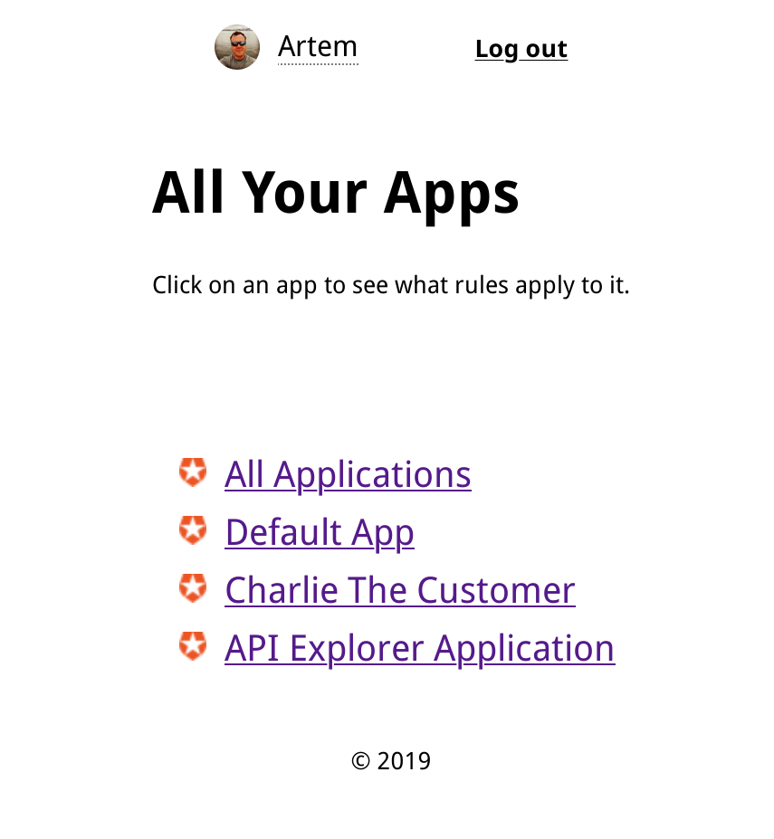
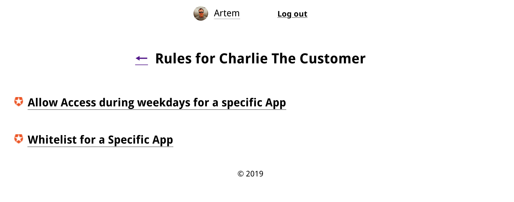
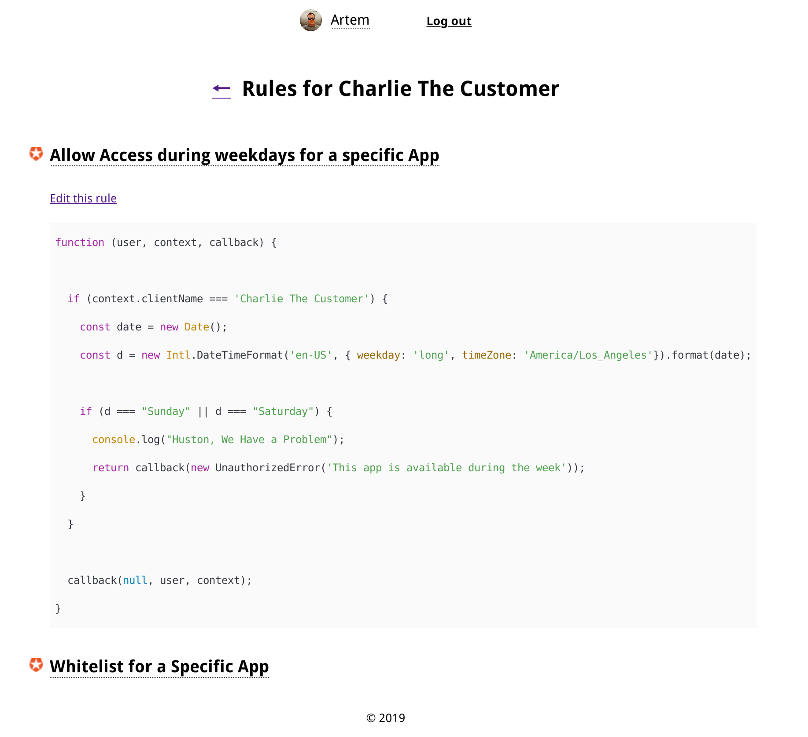

# Auth0 Application Rules App

**WARNING:** Please, keep in mind that this app is a proof-of-concept, and does not take into consideration every security option available, your security policies, specific scopes, and other things you'd need to take care of.

## Overview

This app runs entirely in the browser and doesn't require a backend server. This has security implications, please see them below. 

This app allows you to input your [Auth0](https://auth0.com) credentials, and list all your apps with corresponding rules.

This app requires you to have an Auth0 account. You could set up a rule for this app to make sure only specific whitelisted users have access to it.



Your list of applications updates automatically on page refresh as you dynamically register new apps.

To see a list of rules that apply to a specific application, just click on an app name.



To check rule's code, click on rule's name and the rule will expand, allowing you to make sure it's all good.



## Setup

First step is to create a new application in your Auth0 management panel. It's going to be a Single Page application, and you will need to add `http://localhost:3000` to `Allowed Web Origins`, `Allowed Logout URLs` and `Allowed Callback URLs`  in application setting to run this app locally. If you deploy your app to the web, don't forget to also add its domain name(s) to these sections.

To make this app work with your tenant information, you need to introduce environmental variables. There are two ways to do this:

### Create a `.env` file

In root directory of the project, create a `.env` file. You will need to get your Management API Token (go to APIs in your Auth0 Dashboard, select `Management API`, click on `API Explorer`; read more [here](https://auth0.com/docs/api/management/v2/get-access-tokens-for-test)), your tenant domain, tenant name, and Client ID (the id of the application you've created in the setup step). **WARNING**: Do not use this token in production or if you're planning to deploy your app to public.

Place the following into your `.env.local` file:

```env
REACT_APP_API_MANAGEMENT_TOKEN=your API management token

REACT_APP_TENANT_DOMAIN=your tenant domain

REACT_APP_TENANT=your tenant name

REACT_APP_CLIENT_ID=this app ClientID
```

### Add environmental variable to system environment

If you don't want to create a file with env variables, just use terminal to set them up:

```bash
export REACT_APP_API_MANAGEMENT_TOKEN=your API management token
export REACT_APP_TENANT_DOMAIN=your tenant domain
export REACT_APP_TENANT=your tenant name
export REACT_APP_CLIENT_ID=this app ClientID
```

## Start the app

After you've set up everything, open terminal and follow these steps in project's root directory:

```bash
node -v
```

If you don't get a Node version in response, please install latest Node.js. You can get it [here](https://nodejs.org/en/download/).

```bash
npm install
npm start
```

Go to `http://localhost:3000` to access the app. Login with your Auth0 credentials, and explore the rules you've got!

## Deploy in 60 seconds (totally optional)

**WARNING**: Unless you're OK with your API management token and app ClientID to be available publicly to those wishing to get this information, **DO NOT** deploy this app outside of your intranet. When deployed to the public internet, **YOUR TOKEN WILL BE EXPOSED** in the source code of the app, and could be used to access your account.

To give your team instant access to the app (bearing in mind the warning above), you can deploy it to the web in under a minute. You will need [Now](https://now.sh) account for this (it's free). After you've created an account, follow these in the terminal:

```bash
npm install -g now
```

Now set up your CLI to work with your new Now account:

```bash
now
```

Enter your Now credentials and you're all set. Now, `cd` to the project's root folder and just type `now` in your command line. This will trigger a deployment of this app, and a URL will be copied to clipboard as soon as it's ready.

(If you are me, you can see this app in action [here](https://auth0.rosnovsky.now.sh))
